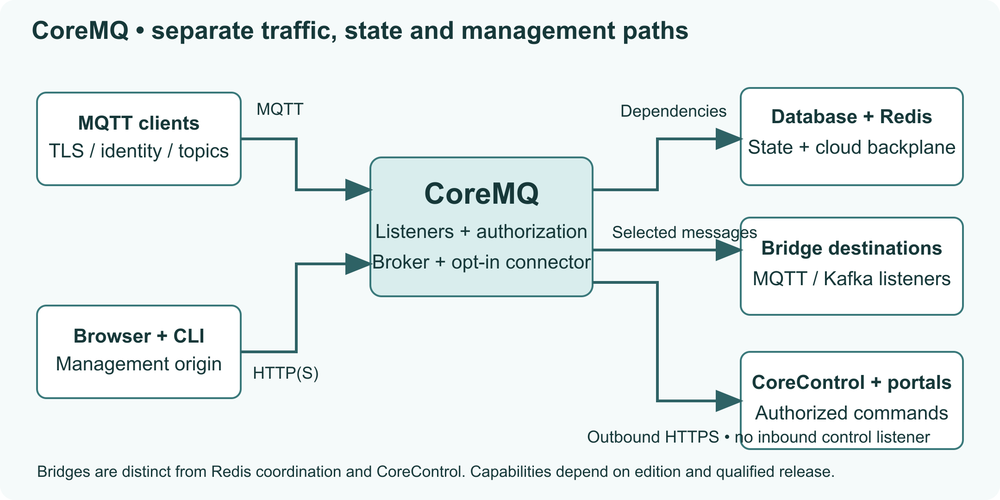

# CoreMQ documentation

Connect devices, manage messaging and operate your broker. Choose a task to get started, or browse the guides by topic.

## Start with a task

::::doc-cards
:::doc-card
### [Send your first message](get-started.md)
Install locally or with Docker, connect a client and publish a test message.
:::
:::doc-card
### [Deploy in your cloud](deployment.md)
Compare Azure, AWS, GCP and private Kubernetes paths and check their prerequisites.
:::
:::doc-card
### [Secure and configure](configure.md)
Set up endpoints, identities, roles and topic permissions.
:::
:::doc-card
### [Operate CoreMQ](operations.md)
Monitor your broker, diagnose a problem and collect useful support evidence.
:::
::::

:::doc-callout
### Know your release
These guides describe the reviewed development implementation. Record your broker version under **Configure > About** and check [release status](release-status.md) before relying on a feature. Installed Marketplace packages and remote controls have their own qualification limits.
:::

## Deploy and connect

- [Azure Marketplace setup](azure/setup.md): installation and network prerequisites.
- [Endpoints and certificates](endpoints.md): listener security and connection settings.
- [Sizing and availability](sizing.md): measured evidence and current capacity limits.
- [CLI reference](cli.md): sign-in, request schemas and command examples.

## Configure messaging and access

::::doc-columns
:::doc-column
### Access

- [Users and certificate identities](users.md)
- [Roles](roles.md)
- [Topic policies and worked examples](policies.md)
- [CoreID and other sign-in providers](sign-in-providers.md)
:::
:::doc-column
### Messaging

- [Bridges and stream destinations](bridges.md)
- [Payload schemas](schemas.md)
- [System events](system-events.md)
- [CoreControl remote management](remote-management.md)
:::
::::

## Keep it running

- [Backup and restore](backup-restore.md)
- [Upgrade, rollback and uninstall](upgrade-uninstall.md)
- [MQTT 5 support limits](mqtt5.md)
- [Product feedback and consent](feedback.md)
- [What's new](CHANGELOG.md)

## How the parts fit

{width=800 style="max-width:100%;height:auto"}

The CLI uses the HTTP(S) management origin. Redis is the cloud backplane; bridges forward selected messages. CoreControl carries authorized remote commands. These paths have different credentials and permissions.

For current evidence and remaining limitations, see [release status](release-status.md) and the [documentation review](quality-review.md).
