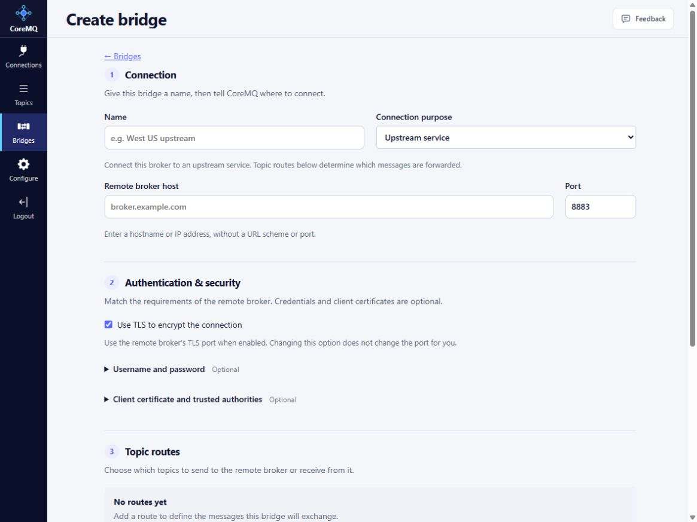

# Bridges and stream destinations

A bridge routes messages between CoreMQ and another messaging system. It does not merge broker users, sessions or configuration, and it does not automatically enroll or pair the remote system.

## MQTT bridges

Open **Bridges**, choose **Create bridge**, and enter a name and destination. MQTT profiles are **Upstream**, **Peer**, and **External**; these classify the connection while using the same MQTT routing engine.

Configure TLS, authentication and uploaded trust material as required by the remote broker. Add explicit topic routes for **Local to remote** or **Remote to local**. Configure separate routes for each direction. JSON direction values remain `LocalToUpstream` and `UpstreamToLocal` for compatibility.

{width=800 style="max-width:100%;height:auto"}

This synthetic September 30 local capture shows the actual editor. **Connection purpose** offers Upstream service, Peer broker, External MQTT broker, Apache Kafka, Azure Event Hubs and CoreStream. MQTT hosts take a hostname/IP without a URL scheme or port; changing TLS does not change the port. Leave **Start this bridge when saved** off while reviewing an unverified destination. **Check settings** validates configuration, not connectivity. Add routes before expecting messages to move.

Validate the configuration, save it, and inspect runtime status. Queue limits, retention, retry limits, maximum hops and message rate are configurable. Do not infer lossless delivery or arbitrary mesh interoperability from a successful connection.

## Kafka, Azure Event Hubs and CoreStream

The development implementation adds **Kafka**, **EventHubs**, and **CoreStream** profiles for outbound delivery to Kafka-compatible listeners. For example, map MQTT filter `devices/+/telemetry` to fixed Kafka topic `device-telemetry`.

- Only local-to-remote delivery is implemented for these profiles.
- The destination topic must already exist; automatic creation is disabled.
- Payload bytes are preserved. The route name is the Kafka key; message ID and origin are record headers.
- Kafka supports TLS and optional SASL/PLAIN credentials. Event Hubs requires TLS and uses `$ConnectionString` as the username with the configured connection-string secret.
- Use CoreStream's Kafka listener. Actual CoreStream and Azure Event Hubs service acceptance remains outstanding.
- Reverse consumption, SCRAM selection, OAuth credential refresh, Kafka client-certificate authentication, arbitrary payload transformations and schema-registry serialization are not implemented.

Messages leave the durable bridge queue after acknowledged production. Uncertain acknowledgements, restarts and lease changes can cause duplicates. Queue saturation can skip forwarding. Producer idempotence is not an end-to-end exactly-once guarantee. A disposable Kafka producer/consumer test passed; cluster lease/failover qualification remains outstanding.

For a new destination, confirm its pre-created topic, listener/TLS and credential scope, save a bounded route, then inspect bridge status and destination consumption with a unique synthetic payload. Verify direction, topic/key, bytes and headers; exercise destination failure/recovery and check backlog, skipped forwarding and duplicates before enabling customer traffic. A connected status alone does not prove delivery.

## Management

```text
coremq bridges list
coremq bridges status
coremq bridges validate --file bridge.json
coremq bridges put <id> --file bridge.json
coremq bridges remove <id> --expected-revision <revision>
```

Use `--schema` to obtain the request format. Local APIs use `/api/Bridges/Configuration` and `/api/Bridges/Validate`; `/api/Uplinks` and CLI `uplinks` aliases remain compatible. CoreControl uses the existing versioned uplink capabilities. See [remote management](remote-management.md).

To export system events, explicitly match their `$SYS/coremq/v1` filter. Incoming bridges cannot forge local `$SYS` publications; map remote system topics into an ordinary application namespace.

## Uploaded files and cleanup

The file picker supports uploading, selecting and refreshing stored files. Managed files are stored encrypted and are append-only: the current management API and UI do not offer per-file editing, deletion or unused-file cleanup.

Clearing a bridge's file reference or deleting the bridge does **not** delete the uploaded file. Review file ownership and retention before uploading, and do not treat reference removal as credential erasure. A disposable test volume can be removed by its owner after testing; that is separate from supported cleanup of an individual file on a running broker.

Candidate 2229 verified public-CA upload and reference changes on disabled synthetic bridges, including revision checks and reference clearing. It did not qualify private credential replacement, actual bridge traffic, provider authentication or remote management parity. See [release status](release-status.md).
