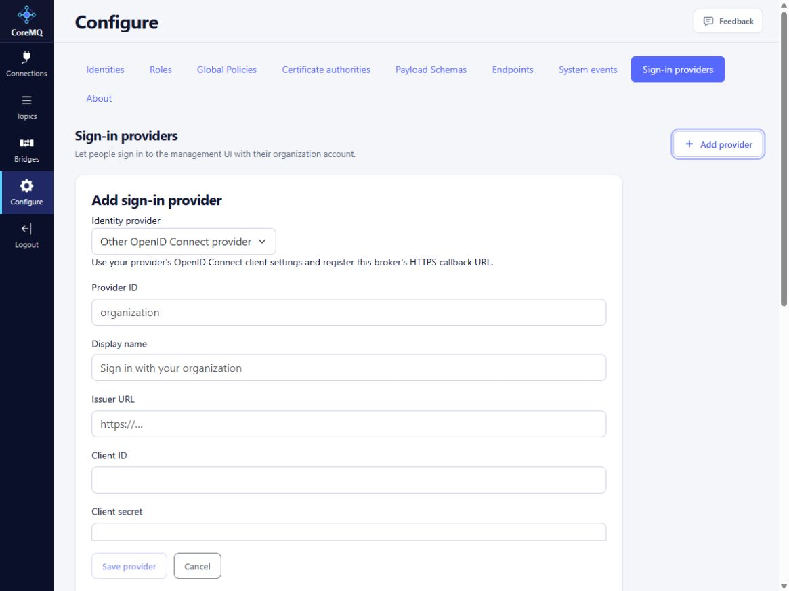

# Browser sign-in providers

CoreMQ supports OpenID Connect for its management UI. Organization identities and local accounts are separate. An organization sign-in never creates, links to, or inherits permissions from a local broker account. MQTT authentication and the Management Portal login are separate capabilities.

## Connect CoreID

Open **Configure > Sign-in providers > Connect CoreID** using the broker's HTTPS address. Sign in to CoreID, select an organization you are authorized to administer, and approve the broker application. CoreID returns you to CoreMQ; the broker verifies the approving identity and saves the application credential on the server.

Registration does not grant broker access. In CoreID, assign application roles to the intended people or groups for this particular broker application. In CoreMQ, edit the provider and map those application roles to CoreMQ permissions. At least one mapped **User Manager** or **Endpoint Manager** role is required to open the management UI. Organization membership or tenant administration alone does not grant broker administration.

**User Manager** manages accounts and security configuration. **Endpoint Manager** manages endpoints and operational views. Map both only when both privileges are intended. Local recovery accounts retain their separately configured permissions.

The CoreID application-role editor is linked from the provider's configuration. Role assignments belong to the selected organization and application; they are not local CoreMQ user records. CoreMQ verifies current CoreID access on each authenticated request. Revocation, an inactive identity, or failure to verify access ends the external session. It never falls back to local permissions.

The organization is an identity membership boundary, not a deployment, region or cloud subscription. Cancel returns to CoreMQ. Registration approval and MFA requirements are enforced by CoreID. Guided activation is immediate; subsequent manual provider changes require a broker restart.

## Organization identities

**Configure > Identities** shows local accounts, organization identities, and certificate identities in one searchable list with an Account type column. Click a column heading to sort all types together by name, type, provider, status, or last sign-in. Local accounts and certificate identities offer Edit and Delete; organization identities offer View permissions, with assignments managed by their provider. Certificate authorities remain in their own trust configuration tab. After a successful organization sign-in, CoreMQ records its provider, display name when supplied, issuer, tenant, subject, last sign-in and observed permissions. **View permissions** opens an independent identity view. There is no associated local account and no local role editor for that identity.

CoreID identities show current application roles and effective CoreMQ permissions. Other providers show permissions observed at the last sign-in, explicitly labeled as observations. Display information is not an authorization grant. Identity keys use the exact issuer, configured tenant and subject, not email matching.

## Other OpenID Connect providers

Choose **Add provider** to configure an existing OIDC registration. Register the exact HTTPS callback `/signin-oidc/{provider-id}` and use the issuer from its discovery metadata. Configure the client ID, protected client secret if required, tenant restriction, and session duration.

Choose **Provider token roles**, specify the signed ID-token claim containing application roles (default `roles`), and map its exact values to CoreMQ permissions. The identity provider must issue that claim to this application. Providers that do not supply suitable application-role claims require an appropriate federation or claim configuration; an organization email address alone grants no access. Changes to token-based assignments apply at the next sign-in or session expiration. CoreID uses its dedicated current-access endpoint instead.

CoreMQ supports authorization code with S256 PKCE, state/nonce, signature, issuer, audience and lifetime validation. Access and refresh tokens are not stored. Sessions are nonpersistent, do not slide, and expire no later than the signed ID token or configured 5–480-minute limit. Provider configuration changes invalidate existing external sessions after restart.

Supported integration uses OIDC; OAuth alone, AWS IAM credentials and SAML-only providers are not browser sign-in protocols for this feature. Provider-specific client registration and claim configuration must be tested in the intended tenant.

## Deployment configuration

Guided registration requires `BrowserIdentity:CoreId:Authority` and `BrowserIdentity:CoreId:BrokerOrigin`. These are trusted deployment settings. A registration in progress belongs to its initiating broker process and browser session.

Example CoreID provider (use your actual issuer, tenant and client):

```json
{
  "BrowserIdentity": {
    "Providers": [{
      "Id": "coreid",
      "DisplayName": "CoreID",
      "Enabled": true,
      "Authority": "https://identity.example.com/",
      "ClientId": "registered-broker-client",
      "ClientSecretFile": "/run/secrets/coremq-coreid-client",
      "TenantClaim": "corevar:tenant_id",
      "TenantId": "11111111-1111-1111-1111-111111111111",
      "Scopes": ["openid", "profile", "email", "roles"],
      "SessionMinutes": 60,
      "AuthorizationSource": "CoreID",
      "RoleMappings": [
        { "ApplicationRole": "broker-operator", "BrokerRole": "Endpoint Manager" }
      ]
    }]
  }
}
```

`Bindings` and `AuthorizationSource: Local` are no longer supported. Configure role mappings and provider-side assignments instead. The provider API does not expose stored secrets. Organization directory observations are stored independently beside the provider configuration in `organization-identities.json`; they have no local account foreign key and never determine permission grants.

The local broker UI provides provider configuration. CoreControl/portal configuration parity must be verified separately; this document does not claim that provider changes are remotely editable through every management surface.

## Provider setup checklist



The September 30 local editor capture uses synthetic data and empty credentials. The HTTP evaluation fixture deliberately cannot save providers: production provider changes require the broker's HTTPS origin.

Choose a **Provider preset**, then confirm every generated value against the registration's discovery metadata. A preset assists configuration; it does not provision the provider application or assign its users.

| Preset | Registration and verification task |
| --- | --- |
| CoreID | Prefer Connect CoreID for guided registration; verify the organization/application assignments and current-access revocation described above |
| Microsoft Entra ID | Register the exact HTTPS web callback, select the intended tenant and emit application-role values in the signed ID token; verify an unauthorized tenant is rejected |
| Auth0 | Create an OIDC web application and allow the exact callback; arrange a signed ID-token role claim, configure its exact claim name and map its values |
| Google Workspace | Register an OIDC web client and callback; verify the issuer and intended tenant restriction. Email domain or Workspace membership alone does not supply mapped management roles; qualify the required claim/federation path before enabling access |
| Amazon Cognito | Register a user-pool application client and callback; use the user-pool discovery issuer, verify the signed group/role claim and configure that exact claim name and values |
| Other OpenID Connect provider | Confirm discovery, authorization-code/S256 support, issuer/audience/tenant validation and a signed role claim; do not substitute a SAML-only or generic OAuth registration |

Test one assigned and one unassigned identity, correct and incorrect tenant, session expiration, role removal and local recovery access. No live external provider qualification is claimed by this UI review.

For CoreID, verify the trusted authority and exact broker HTTPS origin with the operator before starting **Connect CoreID**. Retain local recovery access. After approval, assign a test application role in the selected organization, map it to one intended management permission, and test sign-in plus revocation/current-access failure. Guided local activation is distinct from remote portal onboarding; that path remains separately qualified.

For Microsoft Entra ID, register a web application with the exact broker callback, select the intended tenant and configure application-role claims for the signed ID token. Map exact application role values and test a second, unauthorized tenant. For another OIDC provider, verify discovery issuer and application-role claim behavior rather than treating a generic OAuth/SAML registration as equivalent. This is a manual OIDC path, not a provider-specific guided wizard. No live Entra/other-tenant qualification is claimed by this review.

After a manual save/removal, inspect restart-required status, perform the approved restart and use a fresh sign-in to verify roles. Diagnose callback mismatch, issuer/audience/tenant failure, missing role claim and unassigned roles before granting broader permissions. A provider's successful discovery response does not establish the user's access. Multi-replica activation and cross-portal writes must pass against the exact release.

Direct reads and `put --schema` are described in [CLI](cli.md). September 30 synthetic local checks verified the provider editor can read settings. Mutations require HTTPS; guided/provider tenant and remote workflows remain separately qualified.
